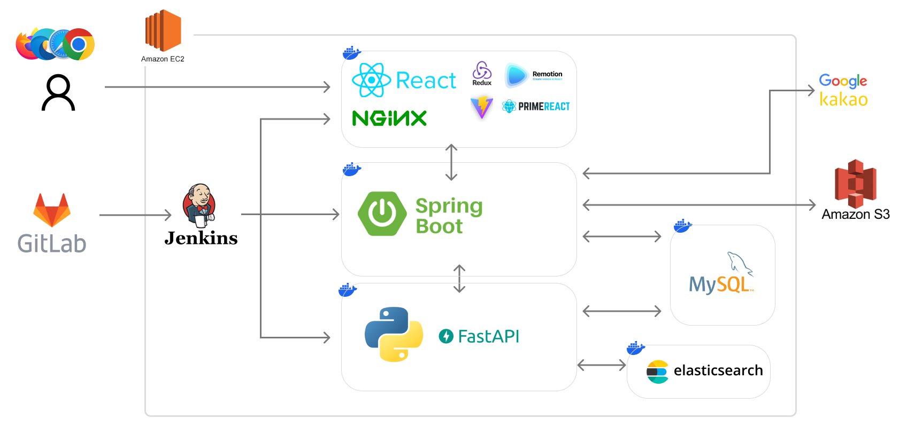
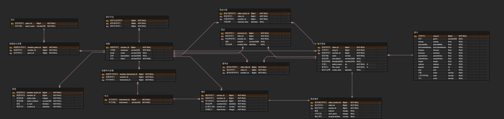

<b>“나의 소소한 연주가, 새로운 음악으로 재탄생하는 플랫폼”</b>

## :clipboard: 개요

"SpringBoot + React 기반 온라인 합주 플랫폼"

- 개발 기간 : 2023. 08. 21. ~ 2023. 10. 06.
- 참여 인원 : 5인
- :tada: SSAFY 9기 특화 프로젝트 우수상 :tada:

## 💡 핵심 기능

- 소셜 로그인(카카오, 구글)
- 솔로 연주 & 합주 녹화 서비스
- 키워드에 따른 검색 시스템
- 선호하는 악기, 유저별 취향 영상에 따른 추천 시스템
- SNS (댓글, 팔로잉, 실시간 알림 서비스)

## 🧑‍💻 추천 요소

- 선호하는 악기(회원가입)
- 선호하는 장르(회원가입)
- 시청한 영상(활동데이터)
- 좋아요한 영상(활동데이터)
- 업로드한 영상(활동데이터)

## 🎬 UCC 영상

## 📆 제작 기간 및 인원

제작 기간 : 2023. 08.21 ~ 2023. 10. 06 (7주)  
참여 인원 : 5인
||||||
|:--:|:--:|:--:|:--:|:--:|
|<a href="https://github.com/Jongwon97">이종원(팀장)</a>|<a href="https://github.com/AtomicLiquors">최효빈</a>|<a href="https://github.com/Park-jong">박종성</a>|<a href="https://github.com/JoonHeeSeo">서준희</a>|<a href="https://github.com/SilvianC">조태규</a>
|Backend, Frontend|Frontend, Design|CI/CD, 추천 시스템, Backend|Backend, Frontend|추천 시스템, 검색 시스템|

## 💻 기술 스택

 

### Backend

 

### Frontend

 

</a>

### CI/CD

### Server

## ERD

## 🔎 시연 영상

    <h3>1. 소셜 로그인</h3>
    <h3>2. 솔로 연주</h3>
    <h3>3. 합주</h3>
    <h3>3-1. 볼륨 조절</h3>
    <h3>3-2. 싱크 조절</h3>
    <h3>4. 영상 검색</h3>
    <h3>5. 추천 영상 조회</h3>
    <h3>6-1. 영상 댓글</h3>
    <h3>6-2. 유저 팔로잉</h3>
    <h3>6-3. 실시간 알림 서비스</h3>

